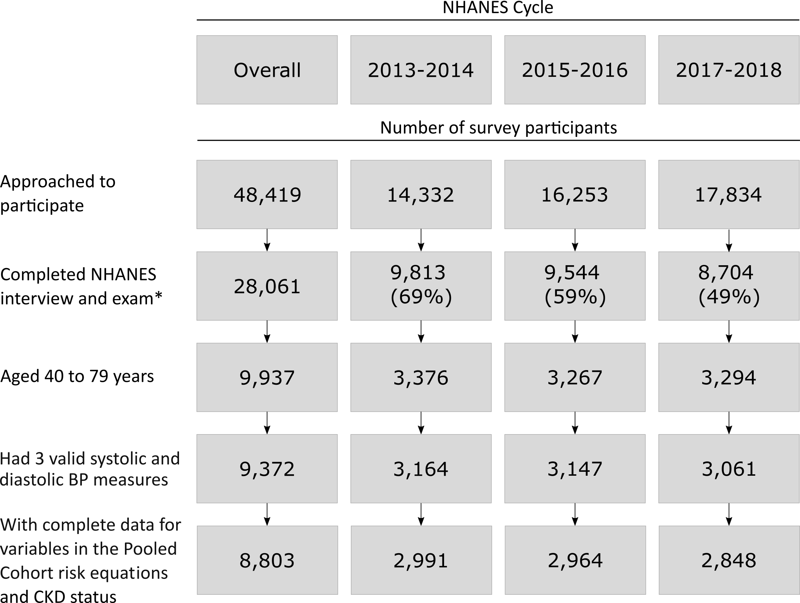

```{r setup, include=FALSE}

# misc functions for the paper

# refers to tables and figures
refer_to <- function(label){
  report$pre_cap[report$reference == label]
}

# fixes list names with symbols
clean_list_names <- function(named_list, case){
  
  new_names <- make_clean_names(string = names(named_list),
                                case = case)
  
  names(named_list) <- new_names
  
  named_list
  
}

# adds counter to abbreviation key
add_counter <- function(data, index){
  data$counter[index] <- data$counter[index] + 1
  data
}

knitr::opts_chunk$set(echo = FALSE)

loadd(exams,
      current_analysis,
      inline,
      report,
      fasted_hrs_lower,
      fasted_hrs_upper,
      gluc_cutpoint_fasted,
      gluc_cutpoint_fed,
      hba1c_cutpoint,
      egfr_cutpoint,
      acr_cutpoint,
      fig_central_illustration)

nhanes_years <- exams %>%
  map_chr(~glue("{.x}-{.x+1}")) %>%
  glue_collapse(sep = ', ', last = ', and ')

rp <- report %>% 
  split(list(.$location, .$object_type))

current_analysis$tbl %<>% 
  mutate(across(where(is.numeric), as.integer))

abbrev_key <- c(
  CVD = 'cardiovascular disease',
  ASCVD = 'atherosclerotic CVD',
  `ACC/AHA` = 'American College of Cardiology and the American Heart Association',
  BP = 'blood pressure',
  SBP = 'systolic BP',
  DBP = 'diastolic BP',
  CKD = 'chronic kidney disease',
  NHANES = 'National Health and Nutrition Examination Survey',
  CI = 'confidence interval',
  ACR = 'albumin-to-creatinine ratio',
  HbA1c = 'glycated hemoglobin',
  eGFR = 'estimated glomerular filtration rate'
) %>% 
  enframe(name = 'acronym', value = 'phrase') %>% 
  mutate(counter = 0)

# create global functions that will refer to abbreviations
# in abbrev_key. The first use of the function spells out
# the acronym in full. All uses thereafter just use the
# acronym. 

# this object must be defined in order for the abbrev functions 
# to dynamically decide whether to use certain acronyms or not.
# e.g., some journals only want 5 acronyms to be used.

max_abbrevs <- 9

abbrev_funs <- map(
  .x = set_names(abbrev_key$acronym, abbrev_key$acronym),
  .f = ~ {
    function(left_mark = '(', right_mark = ')'){
      
      if(!exists('max_abbrevs')) max_abbrevs <- nrow(abbrev_key)
      
      abbrev_index <- which(abbrev_key$acronym == .x)
      
      low_priority <- abbrev_index > max_abbrevs
      
      if(low_priority) return(abbrev_key$phrase[abbrev_index])
      
      counter <- abbrev_key$counter[abbrev_index]
      
      if(counter < 1){
        # modifies abbrev_key in global environment
        abbrev_key <<- add_counter(abbrev_key, abbrev_index)
        string <- glue_data(abbrev_key[abbrev_index,], 
                            "{phrase} {left_mark}{acronym}{right_mark}")
        
      } else {
        
        abbrev_key <<- add_counter(abbrev_key, abbrev_index)
        string <- abbrev_key$acronym[abbrev_index]
        
      }
      
      string
      
    }
  }) %>% 
  clean_list_names(case = 'screaming_snake') %>% 
  list2env(envir = globalenv())


```

<br>
  
<!-- The word count includes text from introduction through the conclusion, references, and figure legends.  -->

<!-- 3,609 / 5000 max -->

Total word count: ~3,700 / 5,000

Byron C. Jaeger, PhD^1^, Swati Sakhuja, MPH^2^, Shakia T. Hardy, PhD, MPH^2^, Oluwasegun P. Akinyelure, MD, MPH^2^, Joshua D. Bundy, PhD, MPH^3^, Paul Muntner, PhD^2^, and Paul K. Whelton, MD, MSc^3^
  
1. Department of Biostatistics, University of Alabama at Birmingham
2. Department of Epidemiology, University of Alabama at Birmingham
3. Department of Epidemiology, Tulane University

__Funding:__ 

Drs Muntner and Jaeger receive support through grant R01HL144773 from the National Heart, Lung, and Blood Institute and grant 15SFRN2390002 from the American Heart Association. 

Dr. Hardy receives support through R01HL139716 from the National Heart, Lung, and Blood Institute.

Dr. Bundy receives support through K12HD043451 from the Eunice Kennedy Shriver National Institute of Child Health and Human Development.

Dr. Whelton receives support through P20GM109036 from the Centers for Research Excellence grant from the National Institute of General Medical Sciences.


__Disclosures:__ 

BCJ has nothing to disclose. 
SS has nothing to disclose.
STH has nothing to disclose.
OPA has nothing to disclose. 
JDB has nothing to disclose.
PM received grant funding and consulting fees from Amgen Inc., unrelated to the current manuscript.
PKW has nothing to disclose.
 
__Address for correspondence:__

Byron C. Jaeger
University of Alabama at Birmingham
327M Ryals Public Health Building
1665 University Blvd
Birmingham, Alabama 35294-0022

__Acknowledgments:__ None.

\newpage

# ABSTRACT

__Background:__ The 2017 American College of Cardiology/American Heart Association blood pressure (BP) guideline recommends using 10-year predicted atherosclerotic cardiovascular disease (ASCVD) risk to guide decisions to initiate antihypertensive medication.

__Objectives:__ Determine if the majority of US adults in subgroups defined by diabetes, chronic kidney disease (CKD), and age ≥65 years have high ASCVD risk (i.e., 10-year predicted ASCVD risk ≥10% or clinical CVD), and estimate the age-adjusted probability of having high ASCVD risk.

__Methods:__ Adults aged 40-79 years from the National Health and Nutrition Examination Survey `r min(exams)`-`r max(exams)+1` were included (n=`r table_value(nrow(current_analysis$data))`). We predicted 10-year ASCVD risk using the Pooled Cohort risk equations and clinical CVD was self-reported. Analyses were conducted overall and among those with stage 1 hypertension, defined by systolic BP of 130-139 mm Hg or diastolic BP of 80-89 mm Hg.

__Results:__ Among US adults, an estimated `r no_ci(inline$prevHighRiskDiabetes)`, `r no_ci(inline$prevHighRiskCkd)`, and `r no_ci(inline$prevHighRiskAge65)` of those with diabetes, CKD, and age ≥65 years had high ASCVD risk, respectively. Among US adults with stage 1 hypertension, an estimated `r no_ci(inline$prevHighRiskS1hDiabetes)`, `r no_ci(inline$prevHighRiskS1hCkd)`, and `r no_ci(inline$prevHighRiskS1hAge65)` of those with diabetes, CKD, and age ≥65 years had high ASCVD risk, respectively. The probability of having high ASCVD risk increased with age and exceeded 50% for US adults with diabetes and CKD at ages `r inline$ageHighRiskOvrlDiabetes` and `r inline$ageHighRiskOvrlCkd` years, respectively. For those with stage 1 hypertension, these ages were `r inline$ageHighRiskS1hDiabetes` and `r inline$ageHighRiskS1hCkd`, respectively.

__Conclusions:__ Most US adults with diabetes, CKD, or age ≥65 years had high ASCVD risk. However, many with stage 1 hypertension did not. 

__Key words__: Atherosclerotic cardiovascular disease, blood pressure, diabetes, chronic kidney disease, risk prediction

\newpage

# ABBREVIATIONS

```{r, results='asis'}

abbrev_key %>% 
  slice(1:max_abbrevs) %>%
  select(-counter) %>% 
  mutate(phrase = str_replace(phrase, 'BP', 'blood pressure'),
         phrase = str_replace(phrase, 'CVD', 'cardiovascular disease')) %>% 
  glue_data("{acronym} = {phrase}") %>% 
  glue_collapse(sep = '\n\n\n')


```

\newpage

# CONDENSED ABSTRACT


The 2017 American College of Cardiology/American Heart Association blood pressure (BP) guideline recommends using atherosclerotic cardiovascular disease (ASCVD) risk to guide decisions to initiate antihypertensive medication. Using National Health and Nutrition Examination Survey `r min(exams)`-`r max(exams)+1` data, it was estimated that `r no_ci(inline$prevHighRiskS1hDiabetes)`, `r no_ci(inline$prevHighRiskS1hCkd)`, and `r no_ci(inline$prevHighRiskS1hAge65)` of US adults with stage 1 hypertension and diabetes, chronic kidney disease and age ≥65 years had high ASCVD risk defined by 10-year predicted ASCVD risk ≥10% or clinical CVD. Predicted 10-year ASCVD risk should be calculated for all adults with stage 1 hypertension and without clinical CVD as many are not at high risk for ASCVD.

\newpage

# Central Illustration

Distribution of US adults by blood pressure and antihypertensive medication use categories. In pie charts, the proportion of adults with stage 1 hypertension at high atherosclerotic cardiovascular disease risk in subgroups defined by diabetes, chronic kidney disease and age ≥ 65 years.
`r fp_par(line_spacing = 1)`

<br>

```{r out.width='100%'}

knitr::include_graphics("../fig/central_illustration.png")

```

High atherosclerotic cardiovascular disease risk was defined by a 10-year predicted risk for atherosclerotic cardiovascular disease ≥ 10% or clinical cardiovascular disease. Data are from the National Health and Nutrition Examination Survey, `r min(exams)`-`r max(exams)+1`.
`r fp_par(line_spacing = 1)`

ASCVD = atherosclerotic cardiovascular disease; CKD = chronic kidney disease

\newpage

# Clinical Perspectives: 

__Competency in Medical Knowledge:__ The 2017 American College of Cardiology/American Heart Association blood pressure guideline recommends using both blood pressure and atherosclerotic cardiovascular disease (ASCVD) risk to guide decisions to initiate antihypertensive medication. 

__Competency in Patient Care:__ The guideline recommends computing 10-year predicted ASCVD risk for all adults with hypertension who do not have clinical CVD.

__Translational Outlook:__ Predicted 10-year ASCVD risk should be computed for all adults with stage 1 hypertension and without clinical CVD, as many are not at high risk for ASCVD.


\newpage

# INTRODUCTION

In November 2017, the `r ACC_AHA()` published a guideline for the prevention, detection, evaluation, and management of high `r BP()` in adults  [@whelton20182017]. This guideline recommends using both `r BP()` levels and predicted risk for `r CVD()` to guide the initiation of antihypertensive medication in addition to nonpharmacological therapy. Initiation of antihypertensive medication is recommended for all adults with a confirmed average `r SBP()` ≥ 140 mm Hg or `r DBP()` ≥ 90 mm Hg, stage 2 hypertension in the guideline. Initiation of antihypertensive medication is also recommended for adults with clinical `r CVD()` or a 10-year risk of `r ASCVD()` events ≥ 10% who have a confirmed average `r SBP()` between 130 and 139 mm Hg and/or `r DBP()` between 80 and 89 mm Hg, stage 1 hypertension in the guideline [@goff20142013]. Additionally, as a matter of practical convenience, adults with stage 1 hypertension and diabetes mellitus, `r CKD()`, or ≥ 65 years of age are considered to have high `r CVD()` risk by the guideline and initiation of antihypertensive medication is recommended. This recommendation, written in Sections 9.3, 9.6, and 10.3 of the guideline, was based on the assumption that the vast majority of adults with diabetes, `r CKD()`, or ≥ 65 years of age are likely to have a 10-year predicted `r ASCVD()` risk ≥ 10% and the knowledge that surveys suggest most clinicians, including cardiologists, do not assess `r CVD()` risk using recommended risk prediction tools [@whelton20182017; @shillinglaw2012use].

<br>

The goal of the current analysis was to estimate the proportion of US adults with diabetes, `r CKD()`, or ≥ 65 years of age that have high `r ASCVD()` risk (defined by 10-year predicted risk for `r ASCVD()` ≥ 10% or clinical `r CVD()`). This analysis was conducted for all US adults and among those with stage 1 hypertension. To accomplish this goal, we analyzed data from `r english(length(exams))` cycles of the US `r NHANES()`.

<br>

# METHODS

`r NHANES()` was designed to assess the health and nutritional status of the non-institutionalized US population and was conducted by the National Center for Health Statistics of the Centers for Disease Control and Prevention [@nhanes_home]. Since 1999-2000, `r NHANES()` has been conducted in two-year cycles using a multistage probability sampling design to select participants. Each cycle is independent with different participants recruited. For the current analysis, the `r english(length(exams))` cycles conducted in `r nhanes_years` were combined [@nhanes_tutorial_weights].  Written informed consent was obtained from each participant. The University of Alabama at Birmingham Institutional Review Board considered the analysis of `r NHANES()` data to be exempt research.

<br>

```{r}

# some inline results for the exclusion paragraph below

n_age_40_to_79 <- current_analysis$tbl %>% 
  filter(label == 'Aged 40-79 years') %>% 
  pull(sample_size) %>% 
  table_value()

n_bp_too_low <- current_analysis$tbl %>% 
  filter(str_detect(label, '^3 or more systolic and diastolic')) %>% 
  pull(n_removed) %>% 
  table_value()

n_missing_pcr <- current_analysis$tbl %>% 
  filter(str_detect(label, '^Complete data for variables')) %>% 
  pull(n_removed) %>% 
  table_value()

n_final <- table_value(min(current_analysis$tbl$sample_size))

```

The current analysis was restricted to adults aged 40 to 79 years of age who completed the `r NHANES()` interview and examination (n = `r n_age_40_to_79`). Participants < 40 or > 79 years of age were not included because use of the Pooled Cohort risk equations is not recommended in these age ranges [@goff20142013]. Participants who did not have three `r SBP()` and `r DBP()` measurements (n = `r n_bp_too_low`) and those who were missing information on age, race, sex, total and high-density lipoprotein cholesterol, smoking status, diabetes, or `r CKD()` status (n = `r n_missing_pcr`) were excluded. After these exclusions, a total of `r n_final` participants were included in the analysis (`r refer_to('fig_include_exclude')`).

<br>

## Data collection

Data were collected during an in-home interview and a study visit completed at a mobile examination center. Standardized questionnaires were used to assess participants’ age, sex, race/ethnicity, smoking habits, medical history, use of antihypertensive medication, oral glucose lowering medication, and insulin. The medical history assessment included questions about whether the participant had been told by a doctor or other health professional that they had a heart attack, coronary heart disease, stroke, or heart failure. Clinical `r CVD()` was defined as answering yes to at least one of these questions. 

<br> 

Blood and urine samples were collected during the medical examination. Serum creatinine, serum glucose and `r HB_A1C()` were measured using standard methods. Diabetes was defined by fasting plasma glucose ≥ `r gluc_cutpoint_fasted` mg/dL (≥ `r gluc_cutpoint_fed` mg/dL for those who were not fasting), `r HB_A1C()` ≥ `r hba1c_cutpoint`%, or self-reported use of insulin or oral glucose lowering medication. `r capitalize(E_GFR())` was calculated using the `r CKD()` Epidemiology Collaboration equation [@levey2009new; @cite_nephro]. Urinary albumin and creatinine levels were measured and used to calculate the `r ACR()`. `r CKD()` was defined by an `r E_GFR()` < `r egfr_cutpoint` ml/min/1.73m^2^ or an `r ACR()` ≥ `r acr_cutpoint` mg/g. Ten-year predicted `r ASCVD()` risk was calculated using the Pooled Cohort risk equations for participants without clinical `r CVD()` [@goff20142013; @lloyd2019use]. High `r ASCVD()` risk was defined as having a 10-year predicted `r ASCVD()` risk ≥ 10% or clinical `r CVD()`.

<br>

## Blood pressure measurements

The same protocol was followed to measure `r SBP()` and `r DBP()` in each `r NHANES()` cycle. After survey participants had rested 5 minutes, their `r BP()` was measured by a trained physician using a mercury sphygmomanometer and an appropriately sized cuff. Three `r BP()` measurements were obtained at 30 second intervals. The mean of all three measurements was used to define `r SBP()` and `r DBP()`. Quality control included re-certification of physicians every quarter with retraining if needed. All physicians participated in annual retraining. 

<br>

## Blood pressure and antihypertensive medication use categories 

<!-- These are hard coded to discourage messing with guideline recs -->

Participants not taking antihypertensive medication were grouped into four non-overlapping categories based on the 2017 `r ACC_AHA()` `r BP()` guideline: normal `r BP()` (`r SBP()` < 120 mm Hg and `r DBP()` < 80 mm Hg), elevated `r BP()` (`r SBP()` between 120 and 129 mm Hg and `r DBP()` < 80 mm Hg), stage 1 hypertension (`r SBP()` between 130 and 139 mm Hg or `r DBP()` between 80 and 89 mm Hg with SBP < 140 mm Hg and DBP < 90 mm Hg), stage 2 hypertension (`r SBP()` ≥ 140 mm Hg or `r DBP()` ≥ 90 mm Hg). Participants taking antihypertensive medication were placed in a fifth category. 

<br>

## Statistical analysis

Analyses were conducted for the overall population and among participants with diabetes, CKD, ≥ 65 years of age, and for those with any of these three characteristics. Participant characteristics were summarized as mean with its standard error for continuous variables and percentage for categorical variables. The percentage of US adults in each of the five categories based on `r BP()` and antihypertensive medication use was computed. The 25^th^, 50^th^, and 75^th^ percentile of 10-year predicted `r ASCVD()` risk and the proportion of participants with high `r ASCVD()` risk were estimated for the overall population and within each of the five categories based on `r BP()` and antihypertensive medication use. To assess the extent to which participants with a 10-year predicted `r ASCVD()` risk < 10% were close to the 10% threshold, we estimated the distribution of 10-year predicted `r ASCVD()` risk. The probability of having high `r ASCVD()` risk was estimated for each year of age from 40 to 79 years using logistic regression. Analyses of participant characteristics, the distribution of 10-year predicted `r ASCVD()` risk, and the probability of having high `r ASCVD()` risk were repeated among participants with stage 1 hypertension.

<br>

```{r}

# R version string with date spelled out in words
R_string <- glue::glue("R version {version$major}.{version$minor}")

date_string <- with(version, paste(year, month, day, sep = '/')) %>% 
  as.POSIXct() %>% 
  format("%B %d, %Y")

R_string_fancy <- glue::glue("{R_string} (released {date_string})")

```


`r NHANES()` sampling weights, which were calculated as the inverse probability of being selected for the survey, were used in all calculations to obtain nationally representative estimates of the non-institutionalized US population. P-values were two-sided. Data analysis was conducted using `r R_string_fancy` along with a collection of open-source software packages [@cite_R; @cite_drake; @cite_tidyverse; @cite_table.glue]. The first author's GitHub repository (< _Link not yet active so we won't be scooped_ >) provides code to reproduce the current study.

<br>

# RESULTS

Among US adults aged 40 to 79 years in `r min(exams)`-`r max(exams)+1`, the estimated prevalence (95% `r CI(left_mark = '[', right_mark = ']')`) of diabetes and `r CKD()` was `r inline$prevDiabetesOverall` and `r inline$prevCkdOverall`, respectively, `r inline$prevAge65Overall` were estimated to be ≥ 65 years of age, and `r inline$prevAnyOverall` had diabetes, CKD, or ≥ 65 years of age (`r refer_to('tab_characteristics')`). The estimated prevalence (95% `r CI()`) of stage 1 hypertension was `r inline$prevS1hOverall` overall and `r inline$prevS1hDiabetes`, `r inline$prevS1hCkd`, `r inline$prevS1hAge65`, and `r inline$prevS1hAny` among those with diabetes, CKD, age ≥ 65 years, and at least one of these conditions, respectively (`r refer_to('tab_bpdist')`). Characteristics of US adults 40 to 79 years of age with stage 1 hypertension, overall and for subgroups defined by diabetes, `r CKD()` and age ≥ 65 years, are presented in Table S1.

<br>

## Predicted 10-year atherosclerotic cardiovascular disease risk

Among US adults aged 40 to 79 years without clinical `r CVD()`, the estimated median (25^th^, 75^th^ percentiles) 10-year predicted `r ASCVD()` risk was `r inline$medianPcrOverall` in the overall population and `r inline$medianPcrDiabetes`, `r inline$medianPcrCkd`, `r inline$medianPcrAge65`, and `r inline$medianPcrAny` among those with diabetes, `r CKD()`, age ≥ 65 years, and any of these conditions, respectively (`r refer_to('tab_risk_overall')`; top panel). Among those with stage 1 hypertension, the estimated median (25^th^, 75^th^ percentiles) 10-year predicted `r ASCVD()` risk was `r inline$medianPcrS1hOverall` in the overall population and `r inline$medianPcrS1hDiabetes`, `r inline$medianPcrS1hCkd`, `r inline$medianPcrS1hAge65`, and `r inline$medianPcrS1hAny` for those with diabetes, `r CKD()`, age ≥ 65 years, and any of these conditions, respectively.

<br> 

Among US adults aged 40 to 79 years, the estimated percentage (95% `r CI()`) with high `r ASCVD()` risk was `r inline$prevHighRiskOverall` (`r refer_to('tab_risk_overall')`; bottom panel). Among sub-groups with diabetes, `r CKD()`, age ≥ 65 years, or any of these conditions, `r inline$prevHighRiskDiabetes`, `r inline$prevHighRiskCkd`, `r inline$prevHighRiskAge65`, and `r inline$prevHighRiskAny` had high `r ASCVD()` risk, respectively. Among those with stage 1 hypertension, the estimated percentage (95% `r CI()`) with high `r ASCVD()` risk was `r inline$prevHighRiskS1hOverall` in the overall population and `r inline$prevHighRiskS1hDiabetes`, `r inline$prevHighRiskS1hCkd`, `r inline$prevHighRiskS1hAge65`, and `r inline$prevHighRiskS1hAny` for those with diabetes, `r CKD()`, age ≥ 65 years, or any of these conditions, respectively.

<br>

Among US adults aged 40 to 79 years without high `r ASCVD()` risk, an estimated `r inline$propLowRiskOverall` had 10-year predicted `r ASCVD()` risk < 2.5% (`r refer_to('fig_hist_ovrl')`). Among subgroups with diabetes, `r CKD()`, age ≥ 65 years, and any of these conditions, an estimated `r inline$propLowRiskDiabetes`, `r inline$propLowRiskCkd`, `r inline$propLowRiskAge65`, and `r inline$propLowRiskAny` had a 10-year predicted `r ASCVD()` risk < 2.5%, respectively. Among those with stage 1 hypertension, an estimated `r inline$propLowRiskS1hOverall` had a 10-year predicted `r ASCVD()` risk < 2.5% (`r refer_to('fig_hist_stg1')`). Also, `r inline$propLowRiskS1hDiabetes`, `r inline$propLowRiskS1hCkd`, and `r inline$propLowRiskS1hAge65` of those with diabetes, CKD, and ≥ 65 years of age had a 10-year predicted `r ASCVD()` risk < 2.5%, respectively.

<br>

## Age-specific probability of having high `r ASCVD()` risk

The estimated probability of having high `r ASCVD()` risk increased with older age and exceeded 50% at `r inline$ageHighRiskOvrlNoComorb` years for US adults without diabetes or `r CKD()`, compared with `r inline$ageHighRiskOvrlDiabetes` years for US adults with diabetes and `r inline$ageHighRiskOvrlCkd` years for US adults with CKD (`r refer_to('fig_risk_ovrl')`). Among US adults with stage 1 hypertension, the age at which the estimated probability of having high `r ASCVD()` risk exceeded 50% was `r inline$ageHighRiskS1hNoComorb`, `r inline$ageHighRiskS1hDiabetes`, and `r inline$ageHighRiskS1hCkd` years for US adults without diabetes or CKD, with diabetes, and with CKD, respectively (`r refer_to('fig_risk_stg1')`). The minimum age where the probability of high `r ASCVD()` risk exceeded 50% was not estimated for adults ≥ 65 years of age as the probability exceeded 50% at all ages above 65 years.

<br>

# DISCUSSION

In the current study, the majority of US adults aged 40 to 79 years with diabetes, `r CKD()`, age ≥ 65 years, and any of these conditions had high `r ASCVD()` risk, defined by a 10-year predicted `r ASCVD()` risk ≥ 10% or clinical CVD. Also, the majority of US adults with stage 1 hypertension who were ≥ 65 years of age had high `r ASCVD()` risk. However, a substantial proportion of US adults with stage 1 hypertension and diabetes or `r CKD()` did not have high `r ASCVD()` risk. Among US adults with `r CKD()` and without high `r ASCVD()` risk, approximately one-third had a 10-year predicted `r ASCVD()` risk < 2.5%. In contrast, over 80% of US adults aged ≥ 65 years without high `r ASCVD()` risk had a 10-year predicted `r ASCVD()` risk between 5% and 10%. The probability of having high `r ASCVD()` risk was age-dependent with over 50% of US adults with diabetes and `r CKD()` having high `r ASCVD()` risk at ages above `r inline$ageHighRiskOvrlDiabetes` and `r inline$ageHighRiskOvrlCkd` years, respectively.

<br>

The current study estimates that about 15% of US adults aged 40 to 79 years have stage 1 hypertension. The 2017 `r ACC_AHA()` `r BP()` guideline recommends computing 10-year predicted `r ASCVD()` risk for all adults with hypertension who do not have clinical `r CVD()` [@whelton20182017]. As many adults with stage 1 hypertension and diabetes or `r CKD()` do not have 10-year predicted `r ASCVD()` risk ≥ 10%, computing 10-year predicted `r ASCVD()` risk for adults with stage 1 hypertension can inform recommendations to initiate antihypertensive medication and inform patient-provider discussions on the potential benefits of treatment.

<br>

Previous studies have shown that the use of predicted `r ASCVD()` risk in addition to `r BP()` can direct antihypertensive medication to adults likely to receive the largest risk reduction benefit [@colantonio20182017; @jaeger2019cardiovascular, @herrett2019eligibility]. For example, in an analysis of the Reasons for Geographic and Racial Differences in Stroke study, those with stage 1 hypertension for whom initiation of antihypertensive medication was recommended versus not recommended by the 2017 `r ACC_AHA()` `r BP()` guideline were roughly 6 times more likely to experience a `r CVD()` event over 8 years of follow-up [@colantonio20182017]. Although a substantial proportion of US adults with stage 1 hypertension and diabetes or `r CKD()` did not have a high `r ASCVD()` risk in the current study, these subgroups were more likely to have high `r ASCVD()` risk compared to the overall US population with stage 1 hypertension, and may therefore still benefit from initiating antihypertensive medication.

<br>

Previous randomized trials and meta-analyses have investigated whether lower `r BP()` goals reduce incident `r CVD()` risk in patients with diabetes, `r CKD()`, or older age. A randomized trial of patients with diabetes and baseline `r SBP()` < 140 mm Hg and `r DBP()` < 90 mm Hg found lower risk of stroke among participants with more intense `r BP()` treatment goals [@schrier2002effects]. The Systolic Blood Pressure Intervention Trial compared an `r SBP()` treatment target of < 120 mm Hg to < 140 mm Hg among older adults (mean age of 68 years) without diabetes. Among participants with `r CKD()`, randomization to the lower `r SBP()` target reduced rates of major `r CVD()` events and all-cause death without evidence of effect modifications by `r CKD()` or deleterious effect on `r E_GFR()` or end stage renal disease [@cheung2017effects]. In the overall population, those randomized to the lower `r SBP()` target experienced lower rates of incident fatal and nonfatal major `r CVD()` events as well as all-cause mortality [@sprint2015randomized]. A systematic review and meta-analysis of 123 studies with 613,815 participants found strong support for lowering `r SBP()` to < 130 mm Hg and providing antihypertensive medication to adults with diabetes, CKD, and various other comorbidities [@ettehad2016blood]. Benefits associated with a `r SBP()` treatment goal of < 130 mm Hg have also been identified in several other meta-analyses [@bundy2017systolic; @reboussin2018systematic]. Collectively, evidence from previous studies suggests that adults with hypertension and diabetes, `r CKD()` or ≥ 65 years of age may experience lower rates of `r CVD()` events by initiating antihypertensive medication with an `r SBP()` treatment goal of < 130 mm Hg versus < 140 mm Hg. 

<br>

It has been suggested that most adults with diabetes, CKD, or ≥ 65 years of age have a 10-year predicted `r ASCVD()` risk ≥ 10% [@whelton20182017]. Previous research has shown that diabetes, `r CKD()`, and older age are each associated with an increased risk for `r ASCVD()` events [@coresh2004evidence; @chronic2010association; @grundy1999diabetes; @lakatta2002age]. Although the current study suggests that a high proportion of US adults with stage 1 hypertension and diabetes or `r CKD()` do not have a 10-year predicted `r ASCVD()` risk ≥ 10%, diabetes and `r CKD()` are associated with a high lifetime `r CVD()` risk [@lloyd2006prediction; @hippisley2010derivation]. Age-specific estimates in the current study suggest that US adults with diabetes or `r CKD()` develop high `r ASCVD()` risk at a younger age than their counterparts without these conditions. Prior studies have also found that cumulative exposure to high `r BP()` is associated with increased `r CVD()` risk [@allen2014blood]. Therefore, for younger adults with diabetes or `r CKD()`, early initiation of antihypertensive medication may be an important step towards lowering lifetime `r CVD()` risk. Estimating lifetime CVD risk may be useful when discussing the initiation of antihypertensive medication among young and middle-aged adults with diabetes or CKD.

<br>

The current study has a number of strengths. The design of `r NHANES()` allows its results to be weighted to provide results that are representative of the US population. Additionally, `r NHANES()` data are collected following a rigorous protocol by trained study staff.  `r BP()` was measured three times following a standardized protocol. However, the results of this study should be considered in the context of known and potential limitations. `r NHANES()` participants completed only one visit and guidelines recommend using the mean `r BP()` averaged over 2 or more visits. In addition, the `r ACC_AHA()` `r BP()` guideline recommends confirmation of office hypertension by measurement of out-of-office `r BP()`s. Additionally, since only one measurement of serum creatinine and urine albuminuria were available, `r CKD()` status may have been mis-classified in some adults. A total of `r table_value(sum(current_analysis$data$bp_cat == 'Stage 1 hypertension'))` participants had stage 1 hypertension, and some subgroups of this population based on diabetes, `r CKD()`, and ≥ 65 years of age were small.

<br>

# CONCLUSIONS 

While the majority of US adults with diabetes, `r CKD()`, or age ≥ 65 years had high `r ASCVD()` risk, many with stage 1 hypertension and diabetes or `r CKD()` did not. Results from the current study support computing 10-year predicted `r ASCVD()` risk for all adults with hypertension, as recommended by the 2017 `r ACC_AHA()` `r BP()` guideline.

<!-- MAIN TABLES -->

\newpage 

`r rp$main.table$caption[1]` 
`r fp_par(line_spacing = 1)`
`r rp$main.table$object[[1]]`

\newpage 

`r rp$main.table$caption[2]` 
`r fp_par(line_spacing = 1)`
`r rp$main.table$object[[2]]`

\newpage 

`r rp$main.table$caption[3]` 
`r fp_par(line_spacing = 1)`
`r rp$main.table$object[[3]]`

\newpage 

<!-- MAIN FIGURES -->

`r rp$main.figure$caption[1]`
`r fp_par(line_spacing = 1)`

```{r fig.width=6, fig.height = 7, dpi = 300}

rp$main.figure$object[[1]]

```

`r rp$main.figure$legend[1]`
`r fp_par(line_spacing = 1)`

\newpage

`r rp$main.figure$caption[2]`
`r fp_par(line_spacing = 1)`

```{r fig.width=6, fig.height = 7, dpi=300}

rp$main.figure$object[[2]]

```

`r rp$main.figure$legend[2]`
`r fp_par(line_spacing = 1)`

\newpage

__SUPPLEMENT__

<!-- SUPPLEMENTAL TABLES -->

\newpage 

`r rp$supplement.table$caption[1]` 
`r fp_par(line_spacing = 1)`
`r rp$supplement.table$object[[1]]`

<!-- SUPPLEMENTAL FIGURES -->

\newpage 

`r rp$supplement.figure$caption[1]`
`r fp_par(line_spacing = 1)`

```{r out.width='100%'}



```

`r rp$supplement.figure$legend[1]`
BP = blood pressure; CKD = chronic kidney disease; NHANES = National Health and Nutrition Examination Survey. 
`r fp_par(line_spacing = 1)`

\newpage

`r rp$supplement.figure$caption[2]`
`r fp_par(line_spacing = 1)`

```{r fig.width=6, fig.height = 7, dpi=300}

rp$supplement.figure$object[[2]]

```

`r rp$supplement.figure$legend[2]`
`r fp_par(line_spacing = 1)`

\newpage

`r rp$supplement.figure$caption[3]`
`r fp_par(line_spacing = 1)`

```{r fig.width=6, fig.height = 7, dpi=300}

rp$supplement.figure$object[[3]]

```

`r rp$supplement.figure$legend[3]`
`r fp_par(line_spacing = 1)`

\newpage

# REFERENCES
